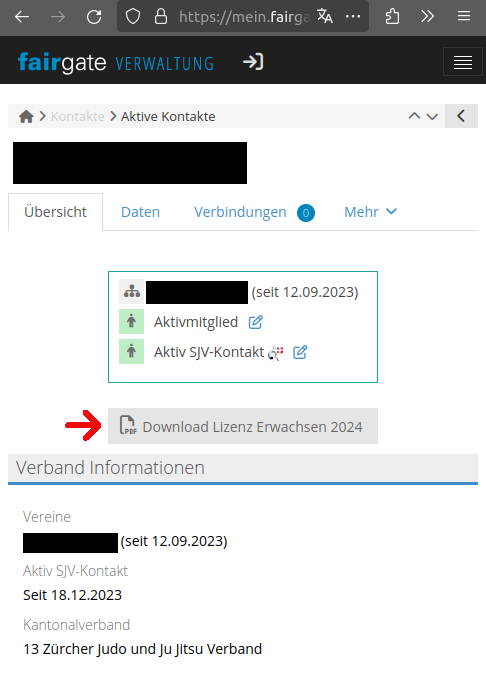

# SJV License Downloader

Downloader for SJV licenses from Fairgate.

## Problem

Downloading the licenses of all members of a Swiss judo club is very inconvenient.

Without this tool, one needs to go over all members and download the license:



This tool automates this process.

## Install

We recommend to install sjv-license-downloader via
[miniconda](https://docs.anaconda.com/miniconda/miniconda-install/). After
installing miniconda, prepare a new environment for sjv-license-downloader via:

```bash
conda env remove -n sjv-license-downloader
conda create --name sjv-license-downloader --yes python=3.12
conda activate sjv-license-downloader
```

Then, you can install sjv-license-downloader:

```bash
pip install argparse selenium PyPDF2 tqdm
```

## Run

Download all SJV licenses from Fairgate:

```bash
python sjv_license_downloader.py --club_name CLUBNAME --username USERNAME --password PASSWORD
```
